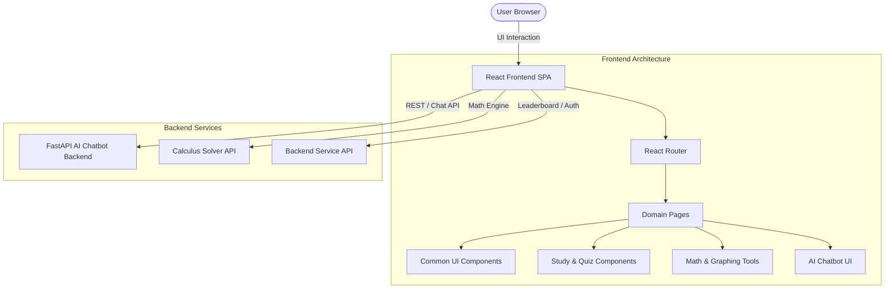

# 🌌 Calculus Runtime

<div align="center">


**An interactive learning platform, visualization suite, and AI-powered calculus workspace.**

[Key Features](#-key-features) • [Architecture](#-project-architecture) • [Getting Started](#-getting-started) • [Directory Structure](#-directory-structure) • [Component Library](#-scalable-component-library) • [Contributing](#-contributing)

</div>

---

## 📖 Overview

**Calculus Runtime** is an educational and computational platform built for mastering:
- **Multivariable Calculus** (Partial derivatives, multiple integrals, divergence, curl, line integrals, Stokes' theorem)
- **Linear Algebra** (Matrices, vectors, eigenvalues, linear transformations, SVD, matrix sandboxes)
- **Probability & Statistics** (Probability distributions, hypothesis testing, regression models, Bayes lab)
- **AI Math Tutoring & Solvers** (Step-by-step math solver, AI tutor chatbot, interactive 2D function grapher)

---

## ✨ Key Features

### 🎓 Interactive Topic Guides & Sandboxes
- **Multivariable Calculus Guides**: Step-by-step guides for partial derivatives, double/triple integrals, limits, vector calculus, and Stokes' theorem with integrated MCQ quizzes.
- **Linear Algebra Suite**: Interactive matrix sandbox, 2D vector transformations, eigenvalue visualizer, and orthogonal least-squares solvers.
- **Probability & Statistics**: Interactive labs for Bayesian probability, random variables, hypothesis testing, and regression analysis.

### 🤖 AI Math Chatbot & Solvers
- **Calculus AI Chatbot**: Conversational AI assistant with LaTeX symbol picker and problem tracking.
- **Step-by-Step Derivations**: Breakdowns of derivatives, limits, and matrix transformations with full math formula rendering.
- **2D Function Plotter & Tangent Tracer**: HTML5 canvas visualizer with interactive zoom, coordinate tooltips, and tangent slope tracers.

### 🏆 Gamified Progress & Certification
- **Progress Tracking**: Real-time progress context with localStorage persistence, completed section indicators, and bookmarking.
- **Course Certificates**: Verification service and verifiable certificates upon completing study modules.
- **Leaderboards**: Competitive quiz leaderboards with time and accuracy scoring.

---

## 🏗 Project Architecture



---

## 📁 Directory Structure

```
calculus-runtime/
├── frontend/                     # React Frontend Application
│   ├── public/                   # Public assets & HTML template
│   └── src/
│       ├── components/           # Modular component system
│       │   ├── common/           # Scalable UI design tokens (Button, Card, Modal, Input, etc.)
│       │   ├── study/            # Learning widgets (ProgressBar, ConceptCard, FormulaViewer, etc.)
│       │   ├── tools/            # Interactive math tools (GraphCanvas, MatrixGrid, StepSolution)
│       │   ├── Chatbot/          # AI Chatbot components & styling
│       │   └── index.js          # Master component barrel export
│       ├── pages/                # Domain-organized route pages
│       │   ├── auth/             # Authentication pages (Login, Signup)
│       │   ├── calculus/         # Calculus guides, blocks & certificates
│       │   ├── certificates/     # Certificate viewer & verification
│       │   ├── courses/          # CourseHub, quiz, and concept explorer
│       │   ├── dashboard/        # Dashboards, study plans, leaderboard
│       │   ├── home/             # Homepage
│       │   ├── linearAlgebra/    # Linear algebra guides, parts & sandbox
│       │   ├── multivariableCalculus/ # Multivariable calculus guides & topics
│       │   ├── probabilityStatistics/ # Probability & statistics guides & labs
│       │   ├── system/           # 404, error pages & placeholders
│       │   ├── tools/            # AI solver, volume calculator, vector fields
│       │   └── index.js          # Master pages barrel export
│       ├── context/              # Global state (AuthContext, ProgressContext)
│       ├── hooks/                # Custom React hooks (useProgress, useStepHints)
│       ├── services/             # API services (chatApi, verificationAPI)
│       ├── utils/                # Helper utilities, KaTeX rendering, math helpers
│       ├── data/                 # Static course questions and curricula
│       ├── styles/               # Global and module CSS styles
│       ├── App.js                # App router & layout entry
│       └── index.js              # React DOM render entry
├── backend/                      # Python backend services
│   ├── core/                     # Core configs & helpers
│   └── routers/                  # API endpoints
├── Calculus-AI-Chatbot/          # AI chatbot service
│   └── backend/                  # FastAPI chatbot backend
├── calculussolver/               # Symbolic math computation engine
│   ├── api/                      # Solver API routes
│   └── data/                     # Math datasets & solvers
└── README.md                     # Root project documentation
```

---

## 🧩 Scalable Component Library

All components in `frontend/src/components/` are modular, accessible, and organized for scalability:

| Module | Components | Description |
| :--- | :--- | :--- |
| **`components/common`** | `Button`, `Card`, `Modal`, `Input`, `Badge`, `Alert`, `LoadingSpinner`, `Header`, `Footer`, `Layout`, `Math` | Core design system tokens, responsive glassmorphism containers, and accessible UI controls. |
| **`components/study`** | `ProgressBar`, `ConceptCard`, `FormulaViewer`, `GuideMcq`, `HintButton`, `SectionCompleteBar` | Interactive study widgets with KaTeX math rendering, animated progress, and quiz handlers. |
| **`components/tools`** | `GraphCanvas`, `StepByStepSolution`, `MatrixGrid`, `DerivativeTool` | Interactive HTML5 2D graph plotter, matrix input grids, and collapsible step-by-step solvers. |
| **`components/Chatbot`** | `Chatbot`, `ChatWindow`, `Message`, `MathSymbolPicker`, `ProblemTracker` | Conversational math assistant with quick questions and LaTeX symbol picker. |

### Example Usage

```javascript
import { Button, Card, Modal, Badge } from './components/common';
import { ProgressBar, ConceptCard, FormulaViewer } from './components/study';
import { GraphCanvas, StepByStepSolution, MatrixGrid } from './components/tools';
```

---

## 🚀 Getting Started

### Prerequisites
- **Node.js**: `v16.x` or higher
- **npm** or **yarn**
- **Python**: `v3.10` or higher (for backend services)

### 1. Frontend Setup

```bash
# Navigate to frontend
cd frontend

# Install dependencies
npm install

# Start local development server
npm start
```

The application will be available at `http://localhost:3000`.

### 2. Backend & Chatbot Setup

```bash
# Navigate to Calculus-AI-Chatbot backend
cd Calculus-AI-Chatbot/backend

# Create virtual environment (optional)
python -m venv venv
source venv/bin/activate # or venv\Scripts\activate on Windows

# Install Python requirements
pip install -r requirements.txt

# Start FastAPI server
uvicorn app.main:app --reload --port 8000
```

---

## 🧪 Testing

Run frontend test suites:

```bash
cd frontend
npm test -- --watchAll=false
```

---

## 🤝 Contributing

1. Fork the Project
2. Create your Feature Branch (`git checkout -b feature/AmazingFeature`)
3. Commit your Changes (`git commit -m 'Add AmazingFeature'`)
4. Push to the Branch (`git push origin feature/AmazingFeature`)
5. Open a Pull Request

---

## 📄 License

Distributed under the MIT License. See `LICENSE` for more details.
